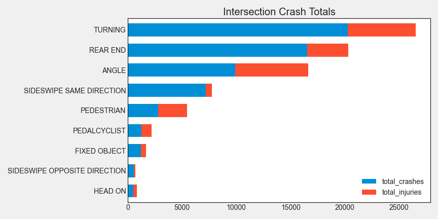

 <h1>Chicago Red Light Camera Safety</h1> 

 <h3>Do Red Light Cameras Make Chicago Intersections Safer?</h3> 

## Background

In 2003, Chicago began its red light camera enforcement with two cameras. Since that time, the program has grown to over 350 cameras at more than 150 Chicago intersections.

The origin and intent of the program (as stated on their [website](https://www.chicago.gov/city/en/depts/cdot/supp_info/red-light_cameraenforcement.html)) is “to increase safety on Chicago streets by reducing the most dangerous types of crashes at intersections. While all crashes are potentially hazardous, Red Light cameras are designed to reduce angle (or “t-bone”) crashes because of their extreme danger to those involved. As individuals comply with traffic signals, serious crashes and injuries reduce significantly.”

A [national study](https://thedaily.case.edu/red-light-cameras-dont-reduce-traffic-accidents-improve-public-safety-analysis/) of red light camera safety was conducted at Case Western University in 2018. Using red light cameras in and around Houston, it concluded that red light cameras reduce the number of dangerous angle crashes, but may also increase the number of rear-end and other types of accidents, thus not improving overall safety. This and other studies, point to cameras actually shifting traffic patterns: drivers tend to brake harder and more abruptly, causing different types of accidents, but not reducing the overall number.

## Web App
A web app was built to go along with this project. With it, you can explore detailed Chicago red light camera intersections and crash data. (click image below)

## Big Questions
- Question 1 - What factors contribute to the number of intersection crashes each day in Chicago?
- Question 2 - What characteristics of an intersection are associated with greater numbers of crashes?
- Question 3 - Does the presence of a camera reduce crashes?
- Question 4 - Can we predict the time and/or location of crashes?

## Contents of repository
- **01-build-db.ipynb** - Code to build the SQLite3 db (all other notebooks make queries from database/rlc2.db 
- **02-eda.ipynb** - EDA and preliminary investigation of red light saftey and intersection crashes. 
- **03-crash-regression-models.ipynb** - Linear regression for daily crash data (Question 1)
- **03a-crash-logreg.ipynb** -Calculate Logistic Regression probablilties for day and intersection. (Question 1)
- **04-violations-regression-models.ipynb** - Linear regression for daily violations data
- **05-intersection-char-models.ipynb** - Modeling crashes based only on intersection characteristics (Question 2)
- **06-hourly-crash-model.ipynb** - Citywide hourly red light crash modeling (Question 4)
- **07-rlc-natural-experiment.ipynb** - Use hypothesis testing to determine camera effectiveness (Question 3)

## Data
Since September 01, 2017, all Chicago police precincts have had mandatory uniform crash reporting citywide. More than half a million crash reports are made available at the Chicago Data Portal and are updated daily. Included in the detailed crash reports are the accident type, whether they occurred at a red light intersection, and the latitude/longitude of each accident.  The data portal also contains daily red light camera violations for every camera, and includes the name of the intersection and the latitude/longitude location.

[Chicago Data Portal](https://www.chicago.gov/city/en/narr/foia/CityData.html)

### Crash types
As mentioned, Chicago is looking to reduce angle (‘t-bone’) type accidents. The chart below is generated using only red light intersections in Chicago. Angle type accidents account for 16% of all accidents, but are responsible for 37% of the deaths and 31% of the injuries. Turning accidents (which could also be reduced by red light cameras) are the most numerous, and are the second leading cause of deaths and injuries at red lights behind angle crashes.

### Natural Experiment
The Houston study used a natural experiment that occurred when red light cameras were removed by a voter referendum in that city. Crash data from both before and after their removal could be compared to see if the presence of the camera had an effect on accidents.

I sought to do the same in Chicago. Since 2017, a handful of cameras have been turned on/off, or have been moved to other intersections. These removals and additions create a small scale (7 intersection) natural experiment similar to the Houston study. Additionally, an Illinois House bill is currently in legislation to remove all red light cameras in Chicago, which would create an incredible opportunity to evaluate this experiment at a much larger scale.

    <figure>
        
        <figcaption>Dates of Natural Experiment Intersections</figcaption>
    </figure>

 

    <figure>
        
        <figcaption>Location of Natural Experiment Intersections</figcaption>
    </figure>

## Creating our Dataset
All data is fetched using SQLite3 queries.  The db file (10 tables) can be built by running code in file 01-build-db to get current stats

After starting from more than half a million crashes, the data was filtered to include crashes occurring between September 2017 and January 2021, I was left with over 60,000 intersection related accidents that occurred at one of Chicago’s 3000+ red light intersections.

By using the latitude/longitude, I designated accidents that happened within 30 meters of the center of a red light camera intersection. More than 8000 accidents labeled as red light crashes at a red light camera enforced intersection. This was the primary dataset for the project.

Other datasets included: congestion, daily traffic, covid cases, and red light violations from Chicago Data Portal.  Weather and holiday data from csv files in this repository.

### Building the SQLite Database
- All Chicago Data Portal (CDP) data pulled through Socrata queries using sodapy library.
- **Intersection characteristics** stored as dictionary in local python file stored as **intersection_chars** table.  
- **Daily traffic volume** is added to SQL db as part of intersection characteristics.  The data is from CDP. I use the road (identified in **intersection_chars** table) to look up daily traffic totals for each intersection.  I use the total in all directions.
- **Hourly congestion** (bus speeds) is merged from two different datasets at CDP.  Bus speeds are sometimes not present, so nulll value is filled with 0.9 quantile value since this is normally overnight when no data is present.  The city is broken into 29 regions.  For each region, I converted the speed values to quantile speed for that region so it could be compared across all regions.  I converted to quantile speed to congestion values (100-quantile speed) and that becomes a very important feature for my models.  It is stored in the table **hourly_congestion**
- **Hourly weather** is taken from (open weather data website)[https://openweathermap.org/weather-data] as a one time bulk download.  I store it locally and do not use the api call (pay service).  The download is through Jan 2021 and the used features are temp, snow and rain for each hour.  Stored as **hourly_weather** table.
- **Intersection regions** are found by pulling boundaries for 29 traffic regions in Chicago and assigning region id to each intersection.  Just did a check to see if lat/long of intersection falls within boundaries.  Stored in **intersection_cams**.  The table also contains info about the individual cameras located at each intersection should you ever need them.
- **Daily red light signal violations** are queried from CDP and grouped by interseection rather than camera.  Stored as **daily_violations**
- **Crash data** is queried from CDD.  All crashes are stored in a table (500k in **all_crashes**).  Crashes at signaled intersections are filtered and stored in separate table (60k **signal_crashes**).  Intersections and regions are assigned to 8k crashes at red light camera intersections.  The location data of each accident is used to place it within a region and a function is applied to check if a signal crash is within 50m of one of our red light intersections.
- **Intersection start/end dates**.  It is necessary to know when the cameras were turned off and on in order to answer the question "Do cameras affect accidents?". By going through the daily violations, we can check when the first and last time that a camera was part of the dataset.  We record these values for each intersection and store them in **int_startend** table.
- **All hours table**. For some of the more cumbersome SQL queries in this study, it became necessary to have hourly entries for each region for the 3+ years of the study.  This table simplified the LEFT JOINS used in SQL.  I went through every day contained in the daily violations, and added an entry for every hour and every intersection.  This is over 3 million lines which is the largest query I do for this project.  To make my work easier later, I also added a boolean 'rlc' to track whether the red light camera was on or off on that hour/day.  I do this by cross referencing the int_startend table.  The data is stored as **all_hours**. 
- **Covid data**.  There were big discrepancies in model performance during covid.  Covid daily cases was introduced as a feature to help mitigate.  This is pulled directly from CDP.
- **Holidays**. Another source of outliers was holdiday traffic where there is no rush hour.  This threw off the models, so a holiday table was added that has all of the major and federal holidays for the time of the study and stored as **holidays** table.

## Question 1 - What factors contribute to the number of intersection crashes each day in Chicago?

This question is best answered using model built in **03-crash-regression-models.ipynb**.

The linear regression model has a moderately good fit.  This model looked at around 50k intersection related crashes at traffic signals. The data was aggregated for each day.

Crashes have a lot of noise in the data and are relatively infrequent events at intersections (the average Chicago intersection only has 0.4 accidents per month), so it isn't surprising that modeling is a challenge.

Around 22% of the crashes could be explained by the model.

The features which had the greatest effect on the target (daily crashes) were:
- Weekends (Sat/Sun) average about 4 additional accidents citywide over a typical weekday. 
- Precipitation - For every 8mm of rain/snow, we can expect an additional crash in the city.
- Congestion - In the worst afternoon rush hour, you would expect 5 more accidents than the mean. In the best afternoon rush hour, you would expect 9 fewer accidents than the mean.
- Red light violations - There has moderate cross correlation with congestion.  For every 100 violations, we expect an additional accident.  There are typically 1000 and 5000 thousand violations per day in Chicago. 

The two most useful features were congestion and red light camera violations.  For all citywide models congestion was the overwhelming most important feature. This becomes more apparent in later models.

    <figure>
        
        <figcaption>Peak Congestion correlates with number of crashes daily in Chicago</figcaption>
    </figure>

## Question 2 - What characteristics of an intersection are associated with greater numbers of crashes?

This question can best be answered with **05-intersection-char-models.ipynb**

A dataset was constructed specifically for this project. To create this dataset, I went through all 180+ intersections with red light cameras. I cross referenced it with a map at https://data.cityofchicago.org/Transportation/Average-Daily-Traffic-Counts-Map/pf56-35rv and google maps to compile the following data.
Dataset Features:
- roads (list): of road segments as identified in average-daily-traffic-counts db in link above. Used to determine volume of traffic.
- protected_turn (int): How any of the left turns are protected (left turn arrow).
- total_lanes (int): Count of total lanes. If a road has one lane for all directions N/E/S/W bound traffic, that counts as 4. Rangees from 3 to 14 lanes.
- medians (int): Count of physical median barriers that extend up to intersection.
- exit (int): 0 if no exit. 1 if exit on/off ramp within 100m of center of intersection. Traffic flow is affected by proximity to exit.
- split (int): 1 if it is a divided boulevard (common in Chicago) where divided lanes are split by traffic signals in median. Look at examples on google map.
- way (int): directions of traffic flow. A 4 way intersection might be NESW.
- underpass (int): number of ways that have an underpass extending up to the intersection. These are notoriously bad intersections in Chicago.
- no_left (int): number of no left turn signs. Usually with smaller streets onto larger roads or high volumne intersections.
- angled (int): 1 if angle between two 2way roads is greater than 30 degrees (used 1/2/sqrt(3) rule to measure.
- triangle (int): 1 if three 2way roads meet intersect or form a triangle where all 3 roads <50m
- one_way (int): number of 1 way directions.
- turn_lanes (int): how many directions have physical and identified turn lanes for left hand turns.
- lat (float): latitude of center of inersection.
- long (float): longitude
- intersection (str): name of intersection as defined in signal_crashes table in db
- daily_traffic (int): volume of daily traffic through intersection. Sum of incoming roads from roads list.

Linear Regression gave the best results. I kept it because of the better cross validation and the ability to interpret the results. 

From our linear regression coefficients: 
- Every 50 violations is one more accident per year. (this is the best predictor we have) 
- A 6 way intersection will have about 5 more accidents per year. (2.5 per way) 
- Each additional lane adds about one accident per year. 
- An intersection with 10mph higher speed limit has one more accident per year.

Only a handful of the gathered characteristics meaningfully informed the model. One possible hypothesis: dangerous intersections have had characteristics changed to mitigate the accidents. Medians, no turns, protected turns, no left, cameras etc. were installed to make the intersection safer. Perhaps they only occur at the more dangerous intersections, and their presence is the result rather than the cause of the accidents and should not be considered. For this reason, I chose to only keep variables that were inherent to the intersection, and could not be readily mitigated (lanes, ways, traffic, violations, split, triangles, overpasses, exits).

Among those characteristics, the intersection type was important.  Three common intersection types in Chicago are shown in the image below.  These intersections have more accidents

Note: A random forest model was also built with the daily crash data.  It did have a higher score (MSE) than the linear model. It used similar features (violations, lanes, and traffic added the most predictive value to the model).  A Ridge variant of the linear model was also explored, but did not show improvement over the base linear regression results.

## Question 3 - Is the presence of a camera associated with fewer crashes?
Using the seven intersections with cameras turned on/off during the study timeframe, we constructed a balanced dataset of days on and off.  All cameras have an equal number of on and off days represented in the dataset to minimize bias of any one camera.

The results using a one sided t-test were as follows:

#### Results with target of Total Crashes
<pre>
<code>
Balanced dataset hypothesis testing: 
Null hypothesis: red light cameras have no effect on the number of crashes.
alpha: 0.05
Power: 0.62

n (cam on): 628 days
n (cam off): 628 days

mean (cam on): 0.03185 crash/day
mean (cam off): 0.04777 crash/day

Actual crashes with cams off: 30
Expected crashes with cams off: 20

Standard deviation: 4.40
z score: 2.27
P value: 0.0115

REJECT the null hypothesis
</code>
</pre>

There is a 1.2% probability of observing a sample mean as large as 0.048 when the true population mean is 0.032. We reject the null hypothesis, and accept the alternative hypothesis that the presence of a red light camera reduces the number of accidents at these seven intersections.
These results are counter to the Houston study which was inconclusive about cameras reducing overall accidents.

#### Results with target of Total Injuries
Injury data contains much more noise, but we were able to use the same method to get a result
<pre>
<code>
Balanced dataset hypothesis testing:
Null hypothesis: red light cameras have no effect on the number of injuries.
alpha: 0.05
Power: 0.99

n (cam on): 628 days
n (cam off): 628 days

mean (cam on): 0.00159 injuries/day
mean (cam off): 0.01752 injuries/day

Actual injuries with cams off: 11
Expected crashes with cams off: 1.0

Standard deviation: 1.00
z score: 10.01
P value: 7.030e-24

REJECT the null hypothesis
</code>
</pre>

There is an extremely small probability of observing a sample mean as large as 0.01752 when the true population mean is 0.00159. We reject the null hypothesis, and accept the alternative hypothesis that the presence of a red light camera reduces the number of injuries at these seven intersections.

When performing the same balanced approach and filtering for accident type, the results were mixed and inconclusive. The test power was too small to make a determination if angled accidents were decreased, or rear end accidents were increased. However, all seven intersections had the same or fewer of all types of accidents when red light cameras were present.

## Question 4 - Can we predict the time and/or location of crashes?
With Random Forest Regressaion, we were able to:
- Achieve ~65% accuracy for daily crashes citywide (r2=60)
- Achieve >29% accuracy for daily signal crashes (smaller dataset) with MAE of ~1

#### The most important features for our model:
- hourly congestion 
- red light violations
- temperature 
- year (2020 in particular) 
- number of COVID-19 cases
 
The image below is a small segment of the 3.25 years of data and predictions in the graph from notebook 06. Included is a 5 day moving average.  This model was trained on 60% of the data.  At least 40% of those shown are predictions on test data.

The random forest model had the following stats:

## Conclusion
The presence of red light cameras was not a dominant feature in any of our predictive or regression models, but when doing population testing (hypothesis testing) for a balanced number of observations with camera on and off, we do accept the alternative hypotheses that the presence of red light .  

For the intersections studied, we accept the hypotheses that the presence of red light cameras reduces the number of accidents and injuries at those intersections.  This supports the city of Chicago’s reasoning for installing the cameras to improve safety.  

 
Project Summary Video

## Future Work
An Illinois House bill is currently in legislation to remove all red light cameras in Chicago, which would create an incredible opportunity to evaluate this experiment at a much larger scale.  As many as 100 new intersections could be added to this experiment.  Simply rerun the build-db code to update when this happens.

With more data, we can also determine if the type of accident is affected by the presence of cameras.

There is also an opportunity for predicting the number, and intersections of crashes.  Congestion was the greatest factor in our models.  More detailed congestion data is available.  It is updated about every 15 minutes for hundreds of road segments.
